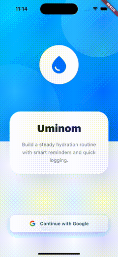

# Uminom

Uminom is a hydration companion that helps you log water intake, stay on track
with daily goals, and receive personalized hydration recommendations.

## Core Features

- Water intake logging with timestamp and volume.
- Daily goal setting with clear progress tracking.
- Visual hydration meter for daily progress.
- Reminder scheduling to stay consistent.
- Generative recommendations for personalized hydration guidance.

## Architecture and Stack

- Flutter
- Riverpod
- MVVM
- Firebase
